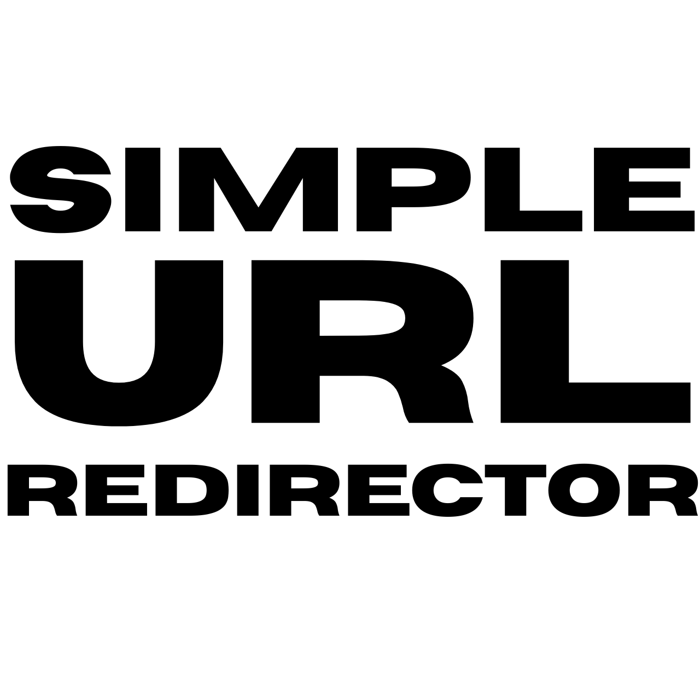

	
  
# Simple URL Redirector (Chrome Extension)

Automatically redirects links from one URL to another, based on rules you define. For example, `redditez.com` to `reddit.com`.

  
  
  
  
  

 
  
It works two ways at once:
- Navigation-level redirect via `declarativeNetRequest`: if you click or type a link to a matching URL, Chrome redirects you straight to the target URL, preserving the path, query, and fragment.
- On-page rewriting via a content script: links already displayed on a page get their `href` rewritten too, so hovering, copying, or middle-clicking shows the correct destination.

## Installation

  
1. click download below to get the zip
2. 
3. Unzip this folder somewhere permanent (don't delete it after installing; Chrome loads it from disk).
4. Open `chrome://extensions` in Chrome.
5. Turn on Developer mode (top right).
6. Click Load unpacked and select the `simple-url-replacer` folder.
7. Click the extension icon in your toolbar to add and manage rules.

## Adding a rule

  
In the popup or options page, enter:
- From: `redditez.com`
- To: `reddit.com`

And click Add rule. From then on, `https://www.redditez.com/r/ProgrammerHumor/s/KlACnhZGrB` becomes `https://www.reddit.com/r/ProgrammerHumor/s/KlACnhZGrB`.

Add as many rules as you like. Each rule has its own on/off toggle, and there's a master switch in the popup to pause all redirects at once.

## Simple vs Advanced Rules

  
Simple rules match whole domains, ignoring leading `www.`.

Advanced rules use regex for more flexibility. Use regex rules let you match complex patterns and use substitution groups.

## Support

If you find this project useful, consider supporting:   
 
  

